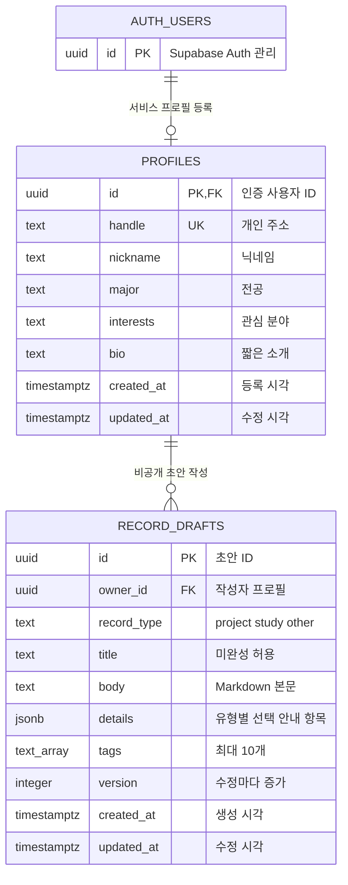

# 데이터 구조 — 회원 프로필·비공개 초안

현재 프로필과 비공개 초안을 구현했다. 발행 기록·핀·보관·연결·사진 테이블은 각 기능 구현 단계에서 추가한다.

- `auth.users`는 Supabase Auth가 관리한다. 회원 가입만으로 서비스 프로필을 자동 생성하지 않는다.
- 인증 사용자 한 명당 프로필은 0개 또는 1개다. 인증 사용자 삭제 시 프로필도 삭제한다.
- `handle`에는 고유 제약, 입력 필드에는 길이·형식 제약을 적용한다.
- `created_at`은 DB가 설정하고 `updated_at`은 수정 트리거로 갱신한다. 일반 사용자는 ID·시각을 수정할 수 없다.
- 이 테이블의 모든 필드는 공개 프로필 정보다. 이메일·인증 토큰·비공개 데이터를 추가하지 않는다.

## DB 권한

| 역할 | 조회 | 등록 | 수정 | 삭제 |
|---|---|---|---|---|
| `anon` 방문자 | 공개 프로필 | 불가 | 불가 | 불가 |
| `authenticated` 회원 | 공개 프로필 | 본인 ID만 | 본인 프로필의 입력 필드만 | 불가 |

PostgreSQL 권한과 RLS 정책을 함께 적용한다. 클라이언트가 Next.js API를 거치지 않고 Supabase API를 직접 호출해도 소유자 규칙을 적용한다. 프로필 삭제 API와 탈퇴는 이번 기능 범위에 포함하지 않았다.

마이그레이션: `supabase/migrations/202610050001_profiles.sql`.

## 비공개 초안 권한과 저장 버전

프로필당 초안 여러 개를 저장한다. 프로필 삭제 시 소유 초안도 삭제한다. `owner_id, updated_at desc, id` 인덱스는 목록 조회를 지원한다. 제목·본문 길이, 태그 개수·길이, 안내 키와 값 형식은 DB 제약으로도 검사한다.

익명은 조회·변경 권한이 없다. 회원은 RLS를 통해 본인 행만 조회·생성·수정한다. ID·소유자·버전·시각의 직접 수정과 삭제 권한은 부여하지 않는다. 트리거가 버전과 수정 시각을 변경하고 API는 현재 버전을 조건으로 원자적으로 수정한다. 공개 프로필 조회로 초안이 노출되지 않는다.

두 번째 마이그레이션은 `supabase/migrations/202610050002_record_drafts.sql`이다. 기존 프로필 마이그레이션 다음에 한 번 적용한다. 공개 발행은 별도 기능으로 구현한다.
