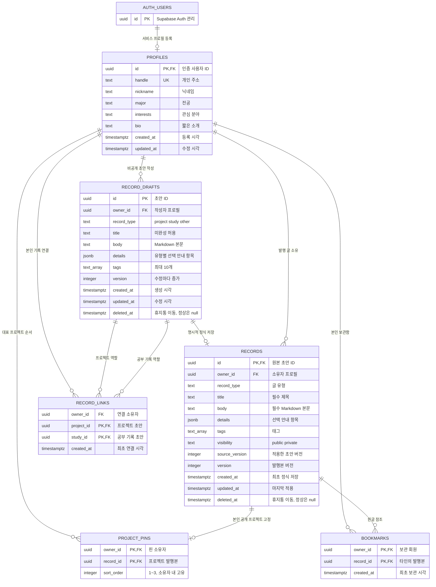

# 데이터 구조 — 회원 프로필·비공개 초안

현재 프로필·비공개 초안·발행 기록·핀·보관함·관련 기록 연결을 구현했다. 사진 테이블은 해당 기능 구현 단계에서 추가한다.

GitHub 가져오기는 기존 `record_drafts`에 새 프로젝트 행을 생성하므로 추가 테이블이나 마이그레이션이 없다. 이름은 title, 설명은 details.intro, 언어 목록은 details.tools와 최대 10개의 tags, README와 원본 URL은 body에 저장한다. 원본 자동 동기화나 별도 불변 출처 필드는 없으며 저장 후 일반 초안처럼 편집·발행한다.

- `auth.users`는 Supabase Auth가 관리한다. 회원 가입만으로 서비스 프로필을 자동 생성하지 않는다.
- 인증 사용자 한 명당 프로필은 0개 또는 1개다. 인증 사용자 삭제 시 프로필도 삭제한다.
- `handle`에는 고유 제약, 입력 필드에는 길이·형식 제약을 적용한다.
- `created_at`은 DB가 설정하고 `updated_at`은 수정 트리거로 갱신한다. 일반 사용자는 ID·시각을 수정할 수 없다.
- 이 테이블의 모든 필드는 공개 프로필 정보다. 이메일·인증 토큰·비공개 데이터를 추가하지 않는다.

## DB 권한

| 역할 | 조회 | 등록 | 수정 | 삭제 |
|---|---|---|---|---|
| `anon` 방문자 | 공개 프로필 | 불가 | 불가 | 불가 |
| `authenticated` 회원 | 공개 프로필 | 본인 ID만 | 본인 프로필의 입력 필드만 | 불가 |

PostgreSQL 권한과 RLS 정책을 함께 적용한다. 클라이언트가 Next.js API를 거치지 않고 Supabase API를 직접 호출해도 소유자 규칙을 적용한다. 프로필 삭제 API와 탈퇴는 이번 기능 범위에 포함하지 않았다.

마이그레이션: `supabase/migrations/202610050001_profiles.sql`.

## 비공개 초안 권한과 저장 버전

프로필당 초안 여러 개를 저장한다. 프로필 삭제 시 소유 초안도 삭제한다. `owner_id, updated_at desc, id` 인덱스는 목록 조회를 지원한다. 제목·본문 길이, 태그 개수·길이, 안내 키와 값 형식은 DB 제약으로도 검사한다.

익명은 조회·변경 권한이 없다. 회원은 RLS를 통해 본인 행만 조회·생성·수정한다. ID·소유자·버전·시각의 직접 수정과 삭제 권한은 부여하지 않는다. 트리거가 버전과 수정 시각을 변경하고 API는 현재 버전을 조건으로 원자적으로 수정한다. 공개 프로필 조회로 초안이 노출되지 않는다.

두 번째 마이그레이션은 `supabase/migrations/202610050002_record_drafts.sql`이다. 기존 프로필 마이그레이션 다음에 한 번 적용한다.

## 발행본과 원자적 적용

`records`는 초안 하나당 발행본 0개 또는 1개를 갖는다. 초안 저장은 발행본을 변경하지 않는다. 발행 시 초안 콘텐츠를 복사해 공개/비공개 상태로 저장한다. 물리적인 초안 삭제 시 발행본도 삭제되는 외래 키를 적용했다. 서비스 삭제는 아래의 휴지통 방식으로 처리한다.

익명은 공개 행만, 회원은 공개 행과 본인 비공개 행만 조회한다. INSERT·UPDATE·DELETE 권한은 두 역할 모두에 없다. `apply_record` 함수만 인증 회원에게 실행을 허용한다. `SECURITY DEFINER` 함수에 빈 search_path·명시적 스키마를 적용하고 내부에서 `auth.uid()`·소유자·두 버전을 검증한다. 익명 및 PUBLIC의 실행 권한은 회수했다.

초안 행과 발행본을 잠근 뒤 한 트랜잭션에서 복사하여 초안 저장과 발행 요청이 엇갈리지 않도록 한다. 오래된 요청이 비공개 상태를 다시 공개하는 것도 발행 버전 검사로 차단한다. 원본 초안 버전은 `source_version`에 보관한다.

세 번째 마이그레이션: `supabase/migrations/202610050003_records.sql`. 발행 이력 전체 대신 마지막 적용본만 저장한다.

## 검색과 복원 가능한 삭제

네 번째 마이그레이션 `202610050004_search_trash.sql`은 두 테이블의 nullable `deleted_at`, 공개 목록용 부분 인덱스, 검색·휴지통 함수를 추가한다. 일반 API는 삭제 행을 제외한다. DB RLS는 익명·타인에게 삭제된 공개 행을 보여주지 않으며, 소유자는 본인 휴지통 복구를 위해 직접 DB 조회로도 본인 삭제 행을 볼 수 있다. 삭제된 초안의 일반 수정은 RLS에서도 차단한다.

`search_records`·`search_archive`는 SECURITY INVOKER로 테이블 RLS를 그대로 적용한다. 공개 검색은 추가로 공개·미삭제만 제한한다. 내 아카이브는 초안에 발행본 메타데이터를 조인하여 기록 ID당 한 결과와 저장/발행 버전을 반환한다. 검색어는 바인딩한 값으로 부분 문자열 검사하고 태그는 배열 포함 연산 `@>`로 AND 조건을 적용한다.

`set_record_deleted`는 SECURITY DEFINER이며 인증 소유자·두 버전을 검사하고 한 트랜잭션에서 두 행을 삭제 상태로 변경하거나 복원한다. 직접 deleted_at 수정 권한은 부여하지 않는다. 복원은 발행본을 비공개로 돌리고 버전을 증가시킨다. 삭제된 초안의 발행도 차단한다. 영구 삭제와 자동 보관 만료는 구현하지 않았다.

## 핀·보관함

`project_pins`는 소유자·기록 복합 기본 키와 소유자·순서 고유 제약을 사용한다. `replace_pins`가 인증 사용자 프로필을 잠가 같은 회원의 교체 요청을 직렬화하고, 대상 발행본을 잠가 공개 범위 변경과 경합하지 않도록 한다. 본인의 정상 공개 프로젝트 최대 3개를 확인한 뒤 전체 순서를 한 트랜잭션으로 교체한다. 비공개·삭제·다른 유형 전환 시 트리거가 핀을 해제한다. 자동 재고정하지 않는다. 남은 핀의 순번에 빈자리가 생겨도 상대 순서는 유지되며 다음 저장에서 1부터 정렬된다.

`bookmarks`는 원글을 복사하지 않는다. 회원은 본인 참조 행만 조회할 수 있으며, 서비스 목록 함수는 타인의 정상 공개 발행본만 조인한다. 비공개·휴지통이면 참조는 유지하고 내용을 숨긴다. 재공개하면 다시 표시되며 해제는 언제든 가능하다. 보관 등록은 공개 발행본 잠금·타인 소유자 검사 후 복합 기본 키 충돌을 무시하여 중복 저장을 막는다.

두 테이블의 직접 변경 권한은 회원에게 주지 않는다. 인증된 저장 함수만 실행할 수 있으며 소유자는 토큰에서 결정한다. 공개 핀 조회는 anon에 허용하고 보관함 함수는 authenticated에만 허용한다. 트리거 함수의 직접 실행은 금지한다. 원글·프로필이 물리 삭제되면 FK cascade로 참조도 제거된다.

## 프로젝트–공부 기록 연결

`record_links`는 초안을 참조해 미발행 기록도 연결한다. 프로젝트·공부 기록 쌍의 복합 기본 키로 중복을 막으며 공부 기록 쪽 역방향 조회에 인덱스를 둔다. 직접 변경 권한은 없고 `set_record_link`가 인증 소유자·두 유형·삭제 상태를 확인한다. 두 초안을 ID 순서로 잠가 유형 변경·삭제와 연결 등록의 경합을 막는다. 재등록은 최초 시각을 유지하고 해제는 본인 참조만 제거한다.

RLS는 본인의 연결 또는 양쪽 발행본이 모두 공개·정상이며 유형과 소유자가 맞는 연결만 허용한다. `list_public_related`는 공개 발행본만, `list_own_related`는 본인 최신 초안만 반환한다. 연결 요약·개수는 각 조회에서 허용된 결과만 기준으로 삼으며 비공개 제목·초안 내용은 공개 조회에서 제외한다.

휴지통·비공개 전환은 참조를 유지하지만 목록에서 필터링한다. 복원·재공개 후 조건을 만족하면 다시 나타난다. 초안 유형 변경 트리거는 기존 연결을 해제하므로 기존 공개본의 연결도 즉시 사라질 수 있다. 연결은 본문 발행 버전과 분리된 메타데이터이며 자동 재연결하지 않는다. 회원·초안을 물리 삭제하면 FK cascade로 연결도 제거한다.
