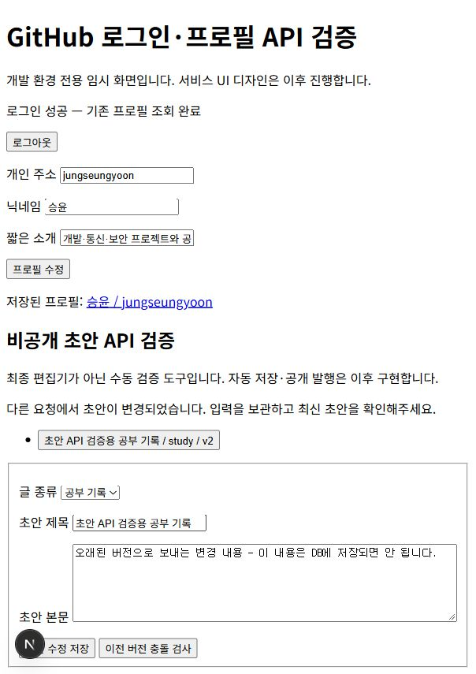
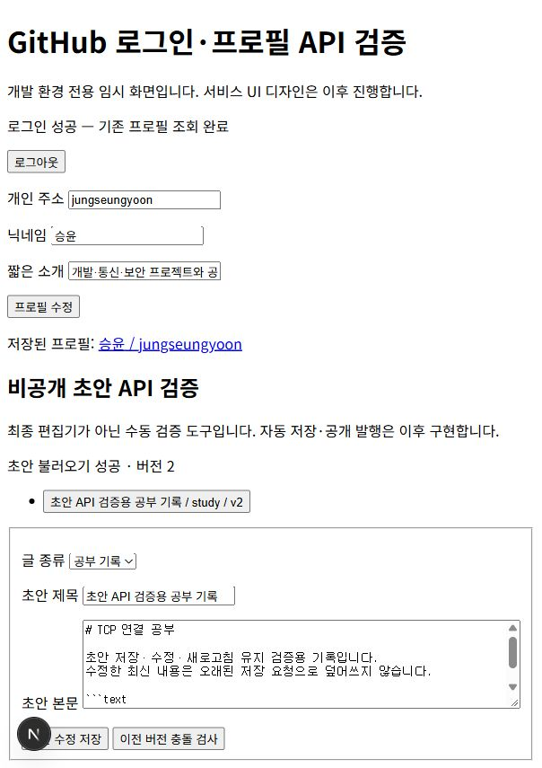
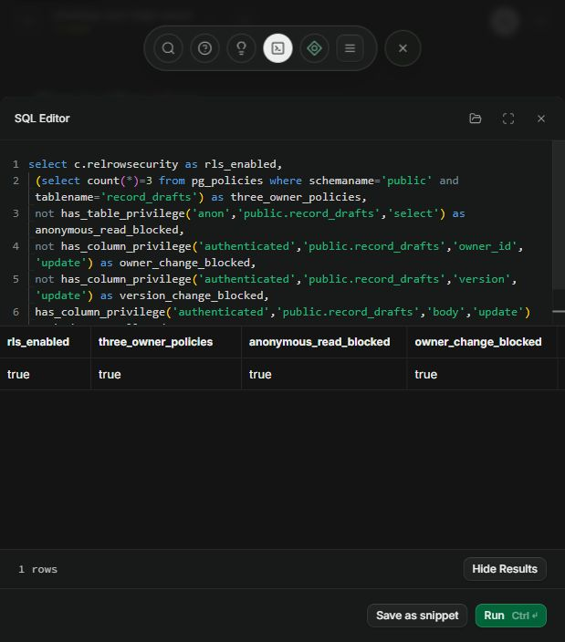

# 비공개 초안 저장 기능 구현

로그인과 프로필 연결 이후 글을 작성하다가 중단해도 저장된 내용을 다시 불러올 수 있도록 초안 API를 구현했다. 프로젝트·공부 기록·기타를 구분하고, 안내 항목은 선택적으로 입력하며 본문은 자유롭게 작성하도록 구성했다. 미완성 기록이므로 제목과 본문이 비어 있어도 저장할 수 있다.

## 파일별 역할

| 파일 | 역할 |
|---|---|
| `lib/draft.ts` | 글 유형·입력 길이·안내 키·태그·버전 검증 |
| `app/api/drafts/route.ts` | 본인 초안 생성과 20개 단위 목록 조회 |
| `app/api/drafts/[id]/route.ts` | 본인 초안 전체 조회와 버전 조건 수정 |
| `supabase/migrations/202610050002_record_drafts.sql` | 초안 테이블·제약·갱신 트리거·권한·RLS |
| `app/auth/check/draft-check.tsx` | 개발 전용 수동 검증 화면 |
| `tests/drafts.test.ts` | 입력·API 흐름·PostgreSQL 권한·오래된 저장 검사 |

기존 `lib/api.ts`의 사용자 인증·응답·오류 처리와 `lib/browser-auth.ts`의 인증 요청 함수를 재사용했다. JSON 읽기는 프로필의 8KB 제한을 유지하면서 초안 요청에만 512KB 제한을 적용하도록 수정했다.

## 요청부터 결과 출력까지

1. 개발 검증 화면에서 글 종류와 제목·본문을 입력하고 저장 버튼을 누른다.
2. 로그인 세션의 Supabase access token을 Authorization 헤더로 전달한다. 토큰은 화면이나 문서에 출력하지 않는다.
3. 서버는 Supabase Auth의 `getUser`로 사용자 인증을 확인한다.
4. 입력을 검증한 뒤 인증 결과의 ID를 소유자로 지정해 초안을 저장한다.
5. DB는 입력 제약과 본인 RLS 정책을 확인하고 ID·버전·시각을 설정한다.
6. 생성 성공은 `201`, 수정 성공은 `200`과 저장된 초안을 반환한다. 성공 응답을 받은 뒤 화면에서 저장 완료를 표시한다.
7. 새로고침 후 본인 초안 목록을 조회하고 선택하면 서버에 저장된 제목·본문·버전이 복원된다.

본문은 줄바꿈·들여쓰기·코드 블록을 보존하는 Markdown 문자열이다. 이번 단계에서는 저장과 복원만 구현했다. 최종 블로그형 편집기와 공개 본문 렌더링은 프런트엔드 단계에서 연결한다.

## 비공개 접근과 저장 충돌

초안 테이블은 공개 프로필과 분리했다. 익명은 조회 권한이 없고 회원도 본인 행만 조회·수정할 수 있다. 요청에서 타인의 사용자 ID를 지정할 수 없으며 타인의 초안 ID로 조회·수정하면 없는 초안과 같은 `404`를 반환한다. DB의 RLS도 직접 호출에 동일하게 적용한다.

두 창이나 연속 요청에서 오래된 저장이 최신 글을 덮어쓰는 것을 막기 위해 버전을 사용했다. 최초 버전은 1이고 수정마다 1 증가한다. 수정 요청은 현재 버전을 보내며 서버는 소유자·초안 ID·버전 조건을 하나의 UPDATE에 적용한다. 버전이 맞지 않으면 `409 DRAFT_VERSION_CONFLICT`를 반환하고 기존 내용을 바꾸지 않는다. 검증 화면에서도 실패 후 입력이 유지되는 것을 확인했다.

생성 요청은 멱등 요청이 아니므로 응답을 잃었을 때 무조건 재생성하지 않고 목록을 확인해야 한다. 10초 자동 저장을 연결할 때도 저장 요청 순서와 충돌·네트워크 실패 복구를 처리해야 한다.

## 검증 결과

- 자동 검사: 전체 15개 통과. 초안 입력·API 응답 모의·PGlite PostgreSQL 검사 3개를 추가했다.
- PostgreSQL 검사: 본인 조회·수정, 타인 행 조회·수정 차단, 소유자 위조 차단, 익명 조회 차단, 버전·소유자·시각 직접 수정 차단, 오래된 버전 저장 차단을 확인했다.
- `npm run typecheck`, `npm run build` 통과.
- 서울 Supabase에 두 번째 마이그레이션을 SQL Editor로 적용했다. RLS 활성화·소유자 정책 3개·익명 조회 차단·소유자 및 버전 직접 수정 차단을 실제 DB에서 확인했다.
- 실제 로그인 계정으로 목록 `200`, 생성 `201`, 수정 `200`, 오래된 버전 저장 `409`, 상세 조회 `200`을 확인했다.
- 실제 초안을 버전 2까지 저장한 뒤 다른 내용을 버전 1로 보내 거부되는 것을 확인했다. 입력은 화면에 유지되었고 새로고침 후 불러온 DB 내용은 버전 2의 최신 본문이었다.

실계정 두 개로 상호 접근을 검사한 것은 아니다. 타인 접근 차단은 실제 마이그레이션을 실행한 로컬 PostgreSQL 권한 검사로 확인했으며, 두 실계정 검사는 통합 검증에서 추가한다. 검증용 공부 기록은 본인 비공개 초안으로 남겨뒀다.

## 오류와 수정

안내 항목의 빈 배열을 TypeScript가 `never[]`로 추론해서 `.includes` 검사에서 타입 오류가 발생했다. 글 종류별 안내 목록을 명시적인 문자열 배열 타입으로 지정한 뒤 타입 검사와 빌드를 통과했다.

DB 마이그레이션 적용 전에 검증 화면을 열었을 때는 테이블이 없어 목록 요청이 `503`이었다. 두 번째 마이그레이션을 적용하고 새로고침한 뒤 목록 `200`을 확인했다. 연결 실패를 빈 목록이나 저장 성공으로 표시하지 않도록 오류 응답을 유지했다.

이번 단계의 완료 범위는 비공개 초안 저장 기반이다. 공개·비공개 정식 발행, 글 삭제·검색, 자동 저장 UI와 최종 편집기는 이어서 구현한다. API 명세서·ERD·기능명세서·README에 현재 구현 범위를 반영했다. 이 자료와 캡처는 아직 티스토리에 게시하지 않았다.
