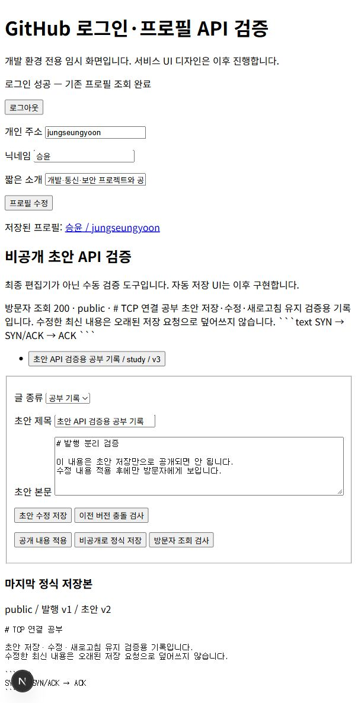
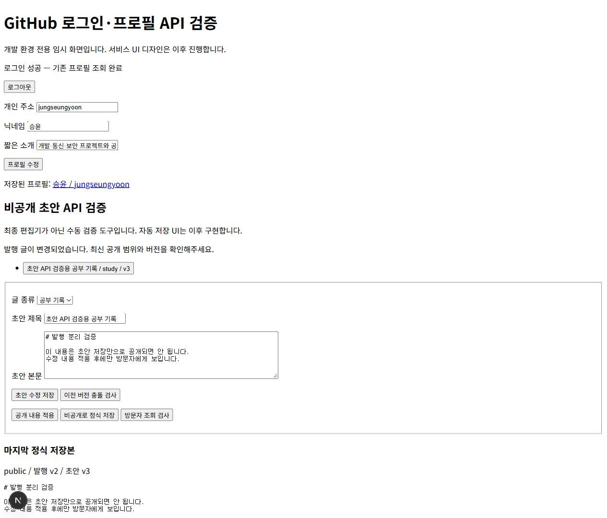
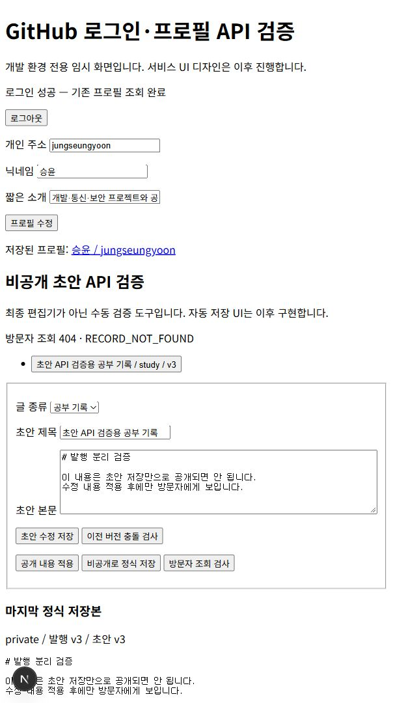
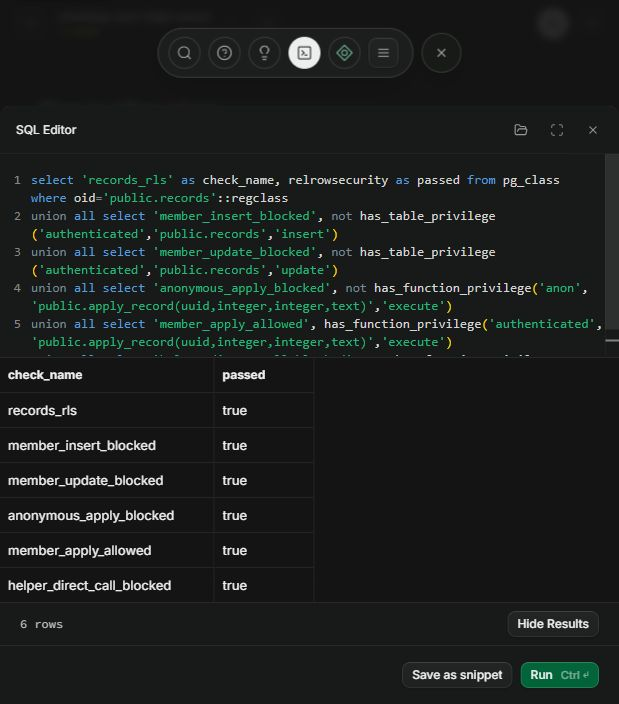

# 공개·비공개 정식 저장 구현

비공개 초안 저장 다음으로 글을 공개하거나 본인용 정식 기록으로 저장하는 기능을 구현했다. 초안은 작성 중인 작업 사본이며 발행본은 마지막으로 명시적 적용한 내용이다. 공개 글의 초안을 수정해도 방문자에게는 기존 공개 내용이 보이도록 두 테이블을 분리했다.

## 파일별 역할과 요청 흐름

| 파일 | 역할 |
|---|---|
| `lib/record.ts` | 발행 요청의 공개 범위·두 버전 검증, 발행본 타입 |
| `app/api/drafts/[id]/publish/route.ts` | 사용자 인증·조건 검증 후 DB 발행 함수 호출, 오류 변환 |
| `app/api/records/[id]/route.ts` | 공개 발행본 또는 본인의 비공개 발행본 조회 |
| `supabase/migrations/202610050003_records.sql` | 발행 테이블·필수 조건·조회 RLS·원자적 저장 함수 |
| `app/auth/check/draft-check.tsx` | 명시적 적용·방문자 조회·초안과 발행본 비교 검증 도구 |
| `tests/records.test.ts` | 발행 조건·API 응답·DB 권한·버전 충돌 검사 |

편집 화면에서 입력한 내용을 먼저 초안으로 저장한다. 공개 또는 비공개 적용 버튼을 누르면 초안 ID·초안 버전·현재 발행 버전·공개 범위를 API로 보낸다. 서버는 인증을 확인하고 DB 함수 `apply_record`를 호출한다. DB 함수는 초안을 잠그고 소유자·버전·제목·본문을 검사한 다음 발행본 버전을 확인해 초안 내용을 복사한다. 성공 응답을 받은 뒤 정식 저장 완료와 마지막 적용본을 표시한다.

발행 글 상세 조회는 초안이 아니라 적용본을 반환한다. 공개 글은 로그인 없이 조회할 수 있으며 비공개 글은 본인만 조회할 수 있다. 방문자에게 비공개 글과 없는 글은 같은 `404`로 처리한다. 현재 검증 화면은 Markdown을 텍스트로 표시한다. 정식 블로그 화면에서는 안전한 렌더링을 별도로 연결한다.

## 두 버전을 검사하는 이유

초안 버전은 발행하려는 내용이 작성자가 확인한 초안인지 검사한다. 발행본 버전은 다른 창에서 변경한 공개 범위나 적용 내용을 보호한다. 초안 버전만 검사하면 다른 창에서 글을 비공개로 바꾼 뒤 오래된 공개 요청이 다시 공개할 수 있다. 두 버전을 함께 검사하면 오래된 요청이 `409`로 거부된다.

발행은 한 트랜잭션에서 수행한다. 회원에게 발행 테이블의 직접 INSERT·UPDATE·DELETE 권한을 주지 않고 저장 함수를 통해서만 변경한다. `SECURITY DEFINER` 함수에는 고정된 빈 search_path와 명시적 스키마를 적용하고, 내부에서도 인증 사용자와 소유자를 확인한다. 익명은 발행 함수를 실행할 수 없다. 본문 유무 검사 함수도 외부 직접 호출 권한을 제거했다.

정식 저장에는 제목·유형·본문이 필요하다. 공백과 기본 서식 기호, 빈 코드 블록·수식·HTML 서식만 있는 본문은 거부하고 내용 있는 코드·수식·사진 링크는 인정한다. 콘텐츠 유무 검사는 본문을 안전하게 렌더링하는 기능을 대신하지 않는다.

## 실제 연결 검증

1. 기존 공부 기록 초안 버전 2를 공개 발행했다. 최초 저장 `201`, 발행 버전 1.
2. 로그인 없는 방문자 조회에서 공개 본문 `200`을 확인했다.
3. 본문을 수정하고 초안 버전 3으로 저장했다. 방문자에게는 여전히 발행 버전 1의 기존 본문이 보였다.
4. 공개 수정 내용을 적용했다. `200`, 발행 버전 2. 이후 방문자 조회에서 새 본문이 보였다.
5. 같은 계정의 다른 창에 발행 버전 2를 불러둔 뒤 원래 창에서 비공개로 적용했다. 발행 버전 3.
6. 다른 창에서 이전 발행 버전 2로 다시 공개 요청을 보내 `409 RECORD_VERSION_CONFLICT`로 거부되는 것을 확인했다.
7. 방문자 직접 조회는 `404 RECORD_NOT_FOUND`였다. 새로고침 후 본인 조회는 비공개 발행 버전 3을 정상 복원했다.

검증용 기록은 최종적으로 비공개 상태로 남겨두었다. 이 검사는 같은 실계정의 두 창과 인증 없는 조회를 사용했다. 별도 실계정의 비공개 접근 차단은 아직 검사하지 않았으며, 로컬 PostgreSQL RLS 검사로 타인 조회·발행 차단을 확인했다.

실제 서울 DB 권한 검사에서도 RLS 활성화, 회원 직접 등록·수정 차단, 익명 발행 함수 실행 차단, 회원 발행 함수 실행 허용, 내부 본문 검사 함수 직접 호출 차단의 6개 항목이 모두 통과했다.

## 검증과 오류 처리

전체 자동 검사 17개, 타입 검사·프로덕션 빌드를 통과했다. 실제 마이그레이션을 실행한 PGlite PostgreSQL 검사에서는 미완성 발행 거부, 초안과 공개본 분리, 소유자 확인, 발행 테이블 직접 변경 차단, 익명 함수 호출 차단, 타인 비공개 조회 차단, 초안 버전·발행 버전 충돌을 확인했다.

입력 조건은 `400`, 없는 초안·타인의 초안은 `404`, 버전 충돌은 `409`로 변환했다. DB 내부 오류 메시지는 그대로 화면에 노출하지 않는다. 충돌 후 임의로 최신 버전을 가져와 자동 재발행하지 않고 사용자가 내용과 공개 범위를 다시 확인하도록 한다. 응답을 잃은 뒤 같은 버전을 재요청해 충돌하는 경우에도 조회로 실제 저장 상태를 확인해야 한다.

이번 범위는 정식 저장·공개 범위·발행본 상세 조회다. 목록·검색·삭제와 핀·보관함·관련 기록의 제외 처리는 다음 기능 단계에서 연결한다. API 명세서·ERD·기능명세서·README를 갱신했고, 자료는 아직 티스토리에 게시하지 않았다.
