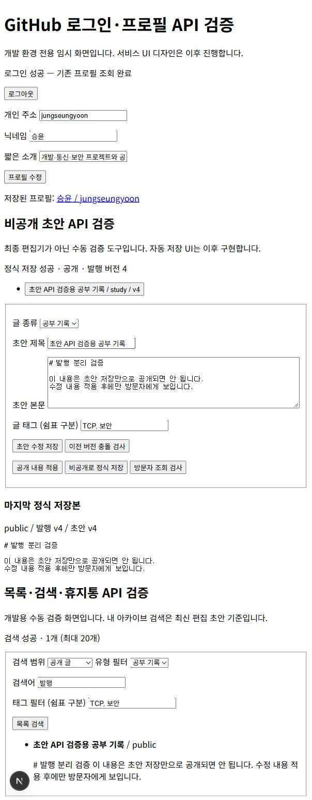
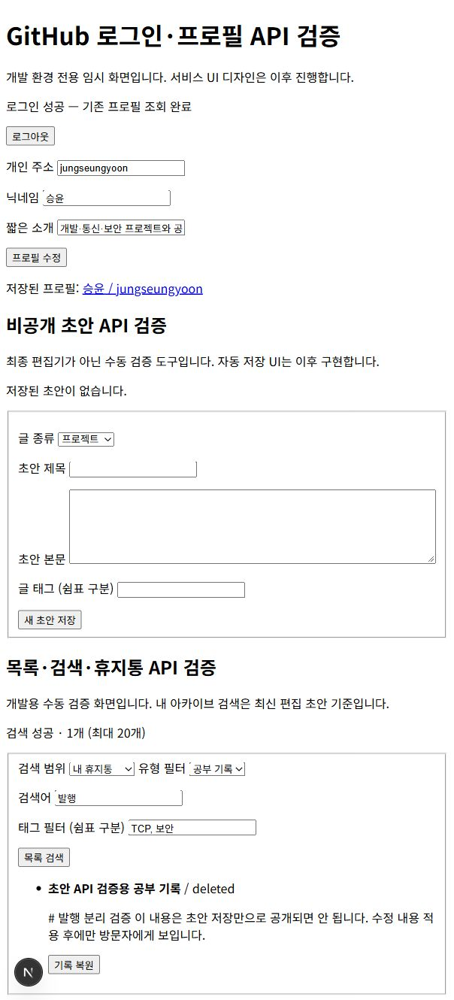
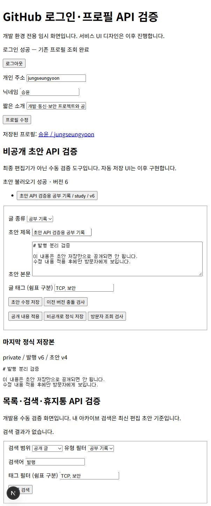

# 글 목록·검색과 휴지통 구현

공개 글을 찾는 검색과 본인의 기록을 관리하는 아카이브 검색을 구현했다. 검색어·글 종류·태그를 함께 적용할 수 있다. 삭제는 초안과 발행본을 휴지통으로 옮기는 방식이며, 복원한 발행본은 비공개로 돌아온다.

## 파일별 역할과 요청 흐름

| 파일 | 역할 |
|---|---|
| `lib/search.ts` | 검색 조건 검증, 20개 단위 목록 응답 구성 |
| `app/api/records/route.ts` | 공개 발행본 검색 |
| `app/api/archive/route.ts` | 인증한 사용자의 최신 초안·공개·비공개·휴지통 검색 |
| `app/api/drafts/[id]/route.ts` | 초안 조회·수정과 휴지통 이동 |
| `app/api/drafts/[id]/restore/route.ts` | 휴지통 기록 복원 |
| `lib/record.ts` | 삭제·복원 요청의 두 버전 검증과 DB 오류 변환 |
| `supabase/migrations/202610050004_search_trash.sql` | 검색 함수·삭제 시각·조회 권한·삭제/복원 트랜잭션 |
| `app/auth/check/archive-check.tsx` | 검색·삭제 확인·복원 수동 검증 화면 |
| `tests/search-trash.test.ts` | 입력·API·실제 SQL과 권한 검사 |

검색 화면에서 입력을 URL 조건으로 만들고 API를 요청한다. 서버는 조건을 검증하고 공개 검색 또는 본인 아카이브 검색 함수를 호출한다. DB는 권한과 조건을 적용해 최신 수정 순으로 결과를 반환한다. API는 최대 20개의 요약과 다음 결과 존재 여부를 응답한다. 검증 화면은 요청 중 입력을 잠그고 성공·결과 없음·실패를 구분한다.

공개 검색은 마지막 발행본을 기준으로 하며 비공개 글과 휴지통 글을 제외한다. 내 아카이브는 최신 편집 초안을 검색한다. 아직 발행하지 않은 기록도 관리할 수 있도록 한 선택이다. 제목·본문·태그의 검색어는 대소문자를 구분하지 않는 부분 문자열이며, 여러 태그는 모두 일치해야 한다. `%`와 `_`는 검색 와일드카드가 아닌 문자로 처리한다.

검색어는 최대 100자, 태그는 최대 10개로 제한한다. 페이지는 offset 방식이며, 목록이 동시에 수정되는 상황에서는 결과가 중복되거나 건너뛰어질 수 있다. 현재 수동 검증 화면은 첫 20개만 표시하며 정식 화면의 페이지 이동은 이후 연결한다.

## 삭제와 복원

삭제 확인을 누르면 초안 버전과 발행본 버전을 전송한다. DB 함수는 인증 사용자·소유자·두 버전을 확인하고 초안과 발행본의 삭제 시각을 한 트랜잭션에서 기록한다. 오래된 화면의 요청은 `409`로 거부한다. 삭제 후 일반 목록·상세 조회·수정·발행에서 제외하며 본인의 휴지통에서만 관리한다.

복원은 두 삭제 시각을 해제하고 발행본을 비공개로 바꾼다. 이전 공개 글이 복원만으로 다시 공개되는 일을 막기 위해서다. 재공개는 사용자가 명시적으로 적용해야 한다. 아직 발행하지 않은 초안은 복원 후에도 미발행 상태다. 영구 삭제와 휴지통 자동 비우기는 이번 범위에 포함하지 않았다.

## 실제 연결 검증

1. 공부 기록에 `TCP`, `보안` 태그를 저장했다. 본인 검색에서 검색어 `발행`·유형 `study`·두 태그를 함께 적용해 1개를 조회했다.
2. 비공개 상태에서는 공개 검색 결과가 없었다. 공개 적용 후 동일한 조건으로 1개를 조회했다.
3. 태그를 `TCP`, `React`로 바꾸자 결과가 없었다. 태그가 AND 조건으로 적용되는 것을 확인했다.
4. 삭제 확인 후 초안과 발행본이 휴지통으로 이동했다. 로그인 없는 상세 조회는 `404 RECORD_NOT_FOUND`였고, 본인의 휴지통에서 1개를 조회했다.
5. 복원 후 초안·발행본 버전이 6이 되었다. 발행본은 `private`, 마지막 적용 내용은 초안 버전 4였으며 공개 검색 결과는 없었다.

검증용 기록은 비공개로 복원해 남겨두었다. 별도의 두 실계정 검사는 수행하지 않았다. 다른 사용자의 조회·삭제 차단은 아래 로컬 DB 권한 검사로 확인했다.

## 검증과 오류 해결

전체 자동 검사 20개와 타입 검사·프로덕션 빌드를 통과했다. 실제 네 개의 마이그레이션을 실행하는 PGlite PostgreSQL 검사에서 공개/비공개 분리, 타인 기록 접근 차단, 익명 아카이브 실행 차단, 삭제 시각 직접 변경 차단, 두 버전 충돌, 삭제된 기록 발행 차단, 비공개 복원과 페이지 경계를 확인했다. 호스팅 DB에 대량 테스트 기록을 만들지 않고 페이지 이동은 로컬 DB에서 검증했다.

검사 코드에서 Node의 기본 TypeScript 실행이 지원하지 않는 생성자 매개변수 속성 문법을 사용했을 때 실행이 실패했다. 속성을 명시적으로 선언하고 생성자에서 할당하는 방식으로 수정했다. 검색 필터는 문자열 SQL 조립 대신 함수 인자로 전달했다. 내부 DB 오류는 그대로 노출하지 않고 입력 오류 `400`, 없는 기록 `404`, 버전 충돌 `409`, 요청 실패 `503`으로 변환한다.

API 명세서·ERD·기능명세서·README를 갱신했다. 핀·보관함·관련 기록 기능은 다음 단계에서 연결한다. 설명과 실제 화면 자료는 준비했으며 티스토리에는 아직 추가 게시하지 않았다.
