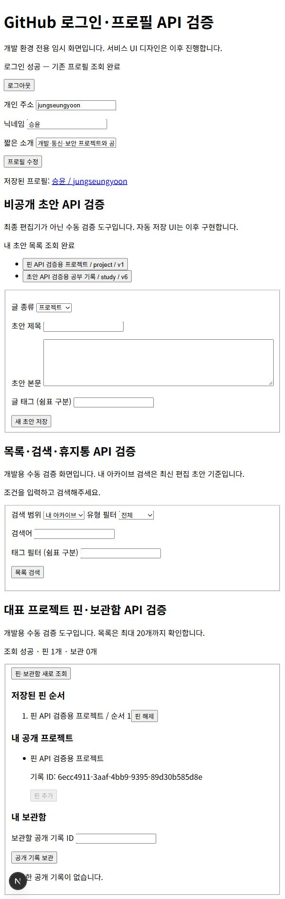
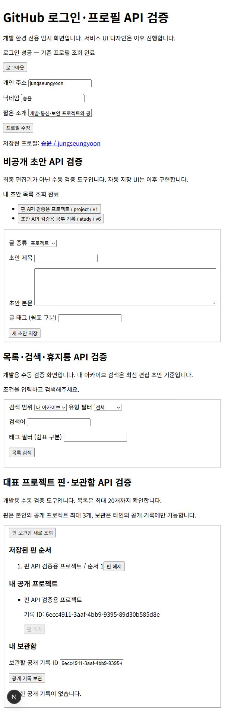
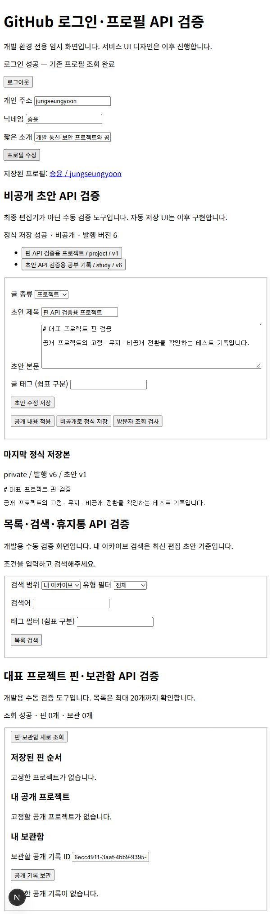
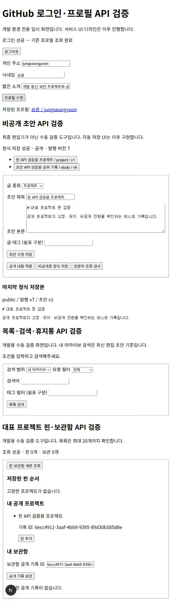

# 대표 프로젝트 핀과 보관함 구현

포트폴리오의 대표 프로젝트를 고정하는 핀과, 다른 사람의 기록을 다시 찾아볼 수 있는 개인 보관함을 구현했다. 핀은 본인의 공개 프로젝트 최대 3개, 보관함은 타인의 공개 프로젝트·공부 기록·기타를 대상으로 한다.

## 파일별 역할과 요청 흐름

| 파일 | 역할 |
|---|---|
| `lib/collection.ts` | 핀 ID·중복·한도 검증과 저장 오류 변환 |
| `app/api/pins/route.ts` | 공개 핀 조회·본인 핀 전체 순서 교체 |
| `app/api/bookmarks/route.ts` | 본인 보관함 요약·페이지 조회 |
| `app/api/bookmarks/[id]/route.ts` | 보관 등록·해제 |
| `supabase/migrations/202610050005_pins_bookmarks.sql` | 테이블·고유 제약·RLS·저장 함수·핀 해제 트리거 |
| `app/auth/check/collection-check.tsx` | 핀 추가·해제·순서·보관 수동 검증 도구 |
| `tests/collections.test.ts` | 입력·API·실제 PostgreSQL 권한과 상태 변화 검사 |

핀 추가·순서 변경·해제는 원하는 전체 ID 배열을 순서대로 API에 보낸다. 서버는 인증과 입력을 확인한 뒤 `replace_pins`를 호출한다. DB는 회원 프로필 행을 잠가 같은 회원의 교체 요청을 직렬화하고, 대상 발행본을 잠가 공개 범위 변경과 경합하지 않게 한다. 본인의 정상 공개 프로젝트인지 확인한 뒤 순서를 한 트랜잭션으로 교체한다. 오류가 발생하면 기존 핀을 유지한다.

핀 순서는 1~3 범위와 회원별 고유 제약을 사용한다. 서버·DB 모두 최대 3개를 제한한다. 비공개 전환·휴지통 이동·다른 글 유형으로 정식 적용하면 트리거가 핀을 해제한다. 재공개해도 자동으로 고정하지 않는다. 핀 제거 후 순번에 빈자리가 생겨도 상대 순서는 유지되며 다음 저장에서 다시 1부터 부여한다. 순서 교체에는 별도 버전이 없으므로 마지막 성공 요청의 전체 순서를 사용한다.

보관 버튼은 기록 ID를 API에 보내고 DB 함수가 인증 사용자와 원글 상태를 확인한다. 본인의 글은 거부하고, 타인의 공개 글만 원글 ID로 저장한다. 회원·기록 복합 기본 키로 중복을 막으며 재요청은 성공한다. 해제는 원글 상태와 관계없이 본인 참조만 제거하고, 이미 해제한 참조도 성공 처리한다.

보관함 조회는 본인 참조와 현재 공개 발행본을 조인한다. 본문 복사본은 만들지 않는다. 원글이 비공개·휴지통이면 참조를 유지하고 내용을 숨긴다. 재공개하면 보관함에 다시 표시되며, 원글 상세 API도 기존 공개 범위 검사를 따른다. 보관함은 최초 보관 순으로 최대 20개씩 조회한다.

## 실제 연결 검증

서울 Supabase에 다섯 번째 마이그레이션을 적용했다. 로그인한 계정에서 검증용 프로젝트를 작성하고 공개 적용한 뒤 핀으로 등록했다. 새로고침 후 목록을 재조회해 핀 1개와 순서 1이 유지되는 것을 확인했다. 인증 없는 공개 핀 API도 같은 프로젝트를 반환했다.

같은 계정의 본인 공개 글을 보관하려는 요청은 거부됐으며 보관함은 빈 상태로 유지됐다.

프로젝트를 비공개로 적용하자 핀 조회 결과가 0개가 되었다. 다시 공개 적용해도 핀은 0개였고 고정 가능한 후보 목록에만 나타났다. 화면 경고 수정 후 같은 흐름을 재검증했으며, 검증 후 프로젝트는 비공개 발행 버전 8로 남겨두었다.

별도 실계정의 글을 보관하는 흐름은 아직 호스팅 환경에서 검사하지 않았다. 서로 다른 인증 사용자 ID를 사용하는 로컬 PostgreSQL 검사에서 타인의 글 보관·중복 방지·재조회·해제·접근 격리를 확인했다. 실제 두 계정을 사용하는 브라우저 통합 검증은 별도로 남아 있다.

## 검증과 오류 해결

전체 자동 검사 23개와 타입 검사·프로덕션 빌드가 통과했다. 새 검사에서는 최대 3개·중복·공개 프로젝트 조건·타인 핀 차단·순서 변경·실패 시 기존 핀 유지·직접 테이블 변경 차단·비공개/삭제/유형 변경 후 핀 제거·재공개 후 자동 핀 방지를 확인했다. 보관함은 본인 글 거부·타인 글 보관·중복·본인 목록 격리·비공개와 휴지통 제외·재공개·반복 해제·페이지 경계를 검사했다.

첫 SQL 검사에서 함수 반환 필드 이름 `position`이 예약어와 충돌하여 구문 오류가 발생했다. 필드를 `sort_order`로 바꾸고 함수 내부 테이블 별칭을 명시해 수정했다. 실제 마이그레이션 적용 전에 로컬 SQL 검사를 통과시켰다.

수동 검증 화면에서는 아카이브 도구와 보관함 도구에 같은 회원 ID를 React key로 사용해 중복 key 경고가 발생했다. 보관함 도구의 key에 역할 접두사를 붙여 구분했다. 빌드를 다시 확인하고 새로고침 후 검증 화면을 확인했다.

API 명세서·ERD·기능명세서·README를 갱신했다. 검증 도구는 최종 서비스 UI가 아니며 목록 첫 20개만 보여준다. 설명과 캡처 자료를 준비했고 티스토리에는 아직 추가 게시하지 않았다.
