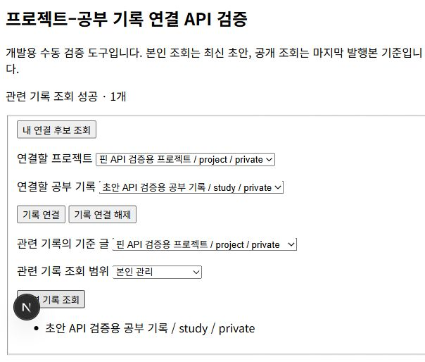
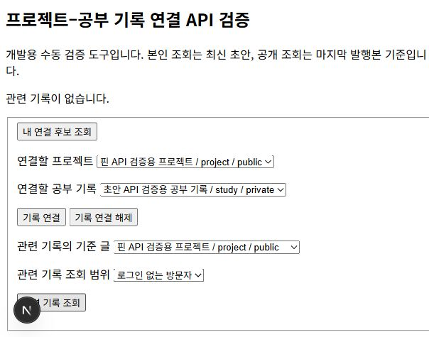
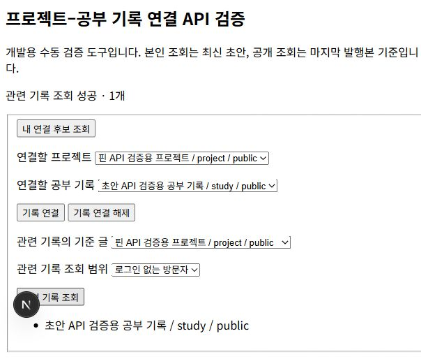

# 프로젝트와 공부 기록 연결 구현

프로젝트에서 관련 공부 기록을, 공부 기록에서 관련 프로젝트를 찾아볼 수 있는 연결 기능을 구현했다. 본인이 작성한 기록끼리 연결하며, 프로젝트 하나와 공부 기록 여러 개를 연결하거나 공부 기록 하나를 여러 프로젝트에 연결할 수 있다.

## 파일별 역할과 요청 흐름

| 파일 | 역할 |
|---|---|
| `lib/link.ts` | 두 UUID·허용 필드·페이지 조건 검증, 오류 변환 |
| `app/api/links/route.ts` | 인증한 회원의 연결 등록·해제 |
| `app/api/drafts/[id]/related/route.ts` | 본인의 최신 초안 기준 관련 기록 |
| `app/api/records/[id]/related/route.ts` | 로그인 없는 방문자의 공개 관련 기록 |
| `supabase/migrations/202610050006_record_links.sql` | 다대다 연결 테이블·RLS·저장/조회 함수·유형 변경 트리거 |
| `app/auth/check/link-check.tsx` | 연결 후보·등록·해제·양방향 조회 수동 검증 도구 |
| `tests/links.test.ts` | 입력·API·SQL·권한·공개 범위 검사 |

내 아카이브에서 프로젝트와 공부 기록을 선택해 두 ID를 API에 전달한다. 서버는 인증과 입력 조건을 확인하고 `set_record_link`를 호출한다. DB는 두 초안을 ID 순서로 잠그고 본인 소유·유형·휴지통 상태를 확인한다. 프로젝트와 공부 기록 쌍의 복합 기본 키로 중복을 막는다. 같은 쌍을 다시 연결해도 최초 연결 시각을 유지한다.

연결이 초안을 참조하므로 미발행·비공개 기록도 연결할 수 있다. 본인의 관련 기록 조회는 최신 저장 초안을 반환한다. 방문자 조회는 마지막 발행본을 사용하며 양쪽 모두 공개된 연결만 반환한다. 관련 글이 비공개라면 제목·본문 요약·태그와 존재 개수도 응답에 포함하지 않는다. 기준 글 자체가 비공개라면 공개 관련 조회는 `404`로 처리한다.

연결은 본문 발행과 분리된 메타데이터다. 연결 등록·해제는 즉시 반영한다. 초안의 글 유형을 바꾸면 기존 연결을 해제하며, 원래 유형으로 돌아와도 자동 재연결하지 않는다. 비공개·휴지통 전환은 연결 참조를 유지하고 해당 목록에서 제외한다. 복원 후 본인 조회에서 다시 보이고, 양쪽을 공개 적용하면 공개 관련 목록에도 다시 표시된다.

## 실제 연결 검증

1. 서울 Supabase에 여섯 번째 마이그레이션을 적용했다.
2. 기존 비공개 프로젝트와 비공개 공부 기록을 연결했다. 프로젝트에서 공부 기록 1개, 공부 기록에서 프로젝트 1개를 조회했다.
3. 새로고침 후 후보를 다시 불러 관련 기록 1개가 유지되는 것을 확인했다.
4. 프로젝트만 공개한 상태에서 방문자 관련 조회는 `200` 빈 배열이었다. 비공개 공부 기록의 공개 관련 조회는 `404`였다.
5. 공부 기록도 공개하자 두 방향 모두 공개 관련 기록 1개를 반환했다.
6. 연결 해제 후 두 방향의 공개 관련 조회가 모두 빈 배열이 되었다.
7. 다시 연결한 뒤 두 기록을 비공개로 정리했다. 프로젝트 발행 버전 10·공부 기록 발행 버전 8이며, 본인 관련 목록에서 연결 1개가 유지됐다.

검증은 한 실계정의 두 기록과 인증 없는 공개 API를 사용했다. 타인 기록 연결 차단은 서로 다른 인증 사용자 ID를 사용하는 로컬 PostgreSQL에서 검사했으며 별도 실계정의 접근 검사는 통합 검증에서 진행한다.

## 검증과 오류 처리

전체 자동 검사 26개와 타입 검사·프로덕션 빌드를 통과했다. 실제 여섯 개의 마이그레이션을 실행하는 로컬 PostgreSQL 검사에서 다대다·중복·양방향 조회·타인 연결과 조회 차단·같은 유형 거부·직접 변경 차단·익명 함수 실행 차단을 확인했다. 초안 제목을 수정해도 공개 관련 목록은 기존 발행 제목을 유지했고, 삭제·비공개 복원·재공개·초안 유형 변경 후 연결 정리도 확인했다. 페이지 경계는 로컬 데이터로 검증했다.

요청 입력은 `400`, 접근할 수 없는 기록은 `404`, 저장소 실패는 `503`으로 처리하고 DB 내부 오류는 노출하지 않는다. 해제는 본인 참조만 지우고 이미 없는 연결에도 성공하므로 응답을 잃은 뒤 재시도할 수 있다. 연결 변경에는 본문 버전 검사를 사용하지 않으며 동일 쌍의 마지막 성공 요청 상태가 적용된다.

API 명세서·ERD·기능명세서·README를 갱신했다. 개발용 후보·관련 목록 화면은 첫 20개만 보여주고, 최종 서비스 UI의 페이지 이동은 이후 연결한다. 티스토리용 설명과 실제 캡처를 준비했으며 아직 추가 게시하지 않았다.
