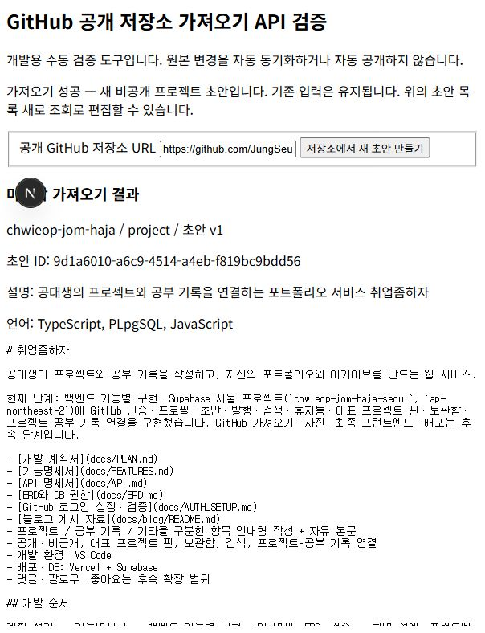
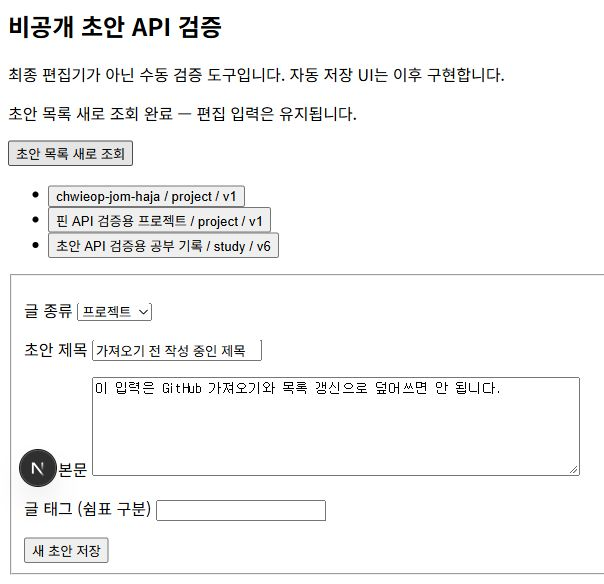
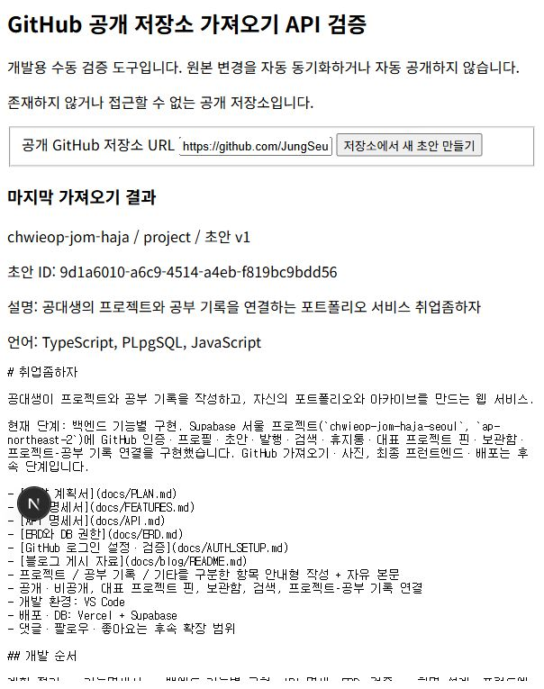

# GitHub 공개 저장소 가져오기 구현

공개 GitHub 저장소 주소를 입력하면 이름·설명·사용 언어·README를 가져와 새 프로젝트 초안을 만드는 기능을 구현했다. 가져온 내용은 일반 초안처럼 편집할 수 있으며 자동 공개·원본 자동 동기화는 하지 않는다.

## 파일별 역할과 요청 흐름

| 파일 | 역할 |
|---|---|
| `lib/github-import.ts` | URL 검증·GitHub 요청·응답 크기/시간 제한·프로젝트 내용 구성 |
| `app/api/imports/github/route.ts` | 사용자 인증·외부 조회 후 새 초안 저장 |
| `app/auth/check/github-import-check.tsx` | URL·로딩·성공/실패·마지막 결과 검증 도구 |
| `app/auth/check/draft-check.tsx` | 편집 입력을 유지하는 목록 갱신·가져온 초안 편집 |
| `tests/github-import.test.ts` | URL·외부 응답·API 저장·토큰 분리·실패 처리 검사 |

입력 URL을 API로 보낸다. 서버는 Supabase 인증을 확인하고 GitHub 저장소 메타데이터를 조회한다. 공개 저장소인지 확인한 다음 언어와 기본 브랜치 README를 병렬로 요청한다. 이름은 제목, 설명은 소개, 사용 언어는 기술 항목과 태그에 넣고 README 뒤에 출처 URL을 붙인다. 모든 외부 조회와 초안 조건 검증이 성공한 뒤 인증 사용자 ID로 새 초안을 INSERT한다.

기존 초안을 수정하는 방식이 아니므로 작성 중인 글을 덮어쓰지 않는다. 가져오기 화면도 기존 편집 도구를 초기화하지 않으며 초안 목록 새로 조회는 편집 입력을 유지한다. 동일 URL 재요청은 별도 초안을 생성한다. 응답을 잃었다면 다시 요청하기 전에 목록을 확인해야 한다.

## 공개 API와 요청 제한

GitHub 로그인과 저장소 조회를 분리했다. GitHub 조회에는 Supabase 사용자 토큰이나 GitHub 로그인 토큰을 전달하지 않는다. 공개 정보만 읽으며 비공개 저장소 접근 권한은 요구하지 않는다. API 호스트를 고정하고 다른 주소·자격 증명·파일 경로·리다이렉트를 허용하지 않아 임의 서버 요청을 막는다.

공유 8초 요청 제한과 메타데이터·언어 각 64KiB, README 400KiB 응답 제한을 적용했다. 출처 포함 본문은 100,000자 이하이며 설명·언어 항목도 기존 초안 제한을 따른다. 큰 README는 임의로 자르지 않고 안내한다. README가 없으면 출처 링크만 남기고 직접 작성할 수 있다.

인증 없는 공개 API의 호출 한도는 배포 서버 IP의 여러 사용자가 공유할 수 있다. 자동 재시도를 하지 않고 제한 응답을 안내하도록 했다. [GitHub 공식 요청 한도 문서](https://docs.github.com/en/rest/using-the-rest-api/rate-limits-for-the-rest-api)를 확인했다. README는 [공식 README 조회 API](https://docs.github.com/en/rest/repos/contents#get-a-repository-readme)를 사용한다. 상대 링크·이미지를 자동 변환하거나 외부 자산을 다운로드하지 않는다.

## 실제 연결 검증

1. 기존 편집 도구에 저장하지 않은 제목과 본문을 입력했다.
2. `JungSeungYoon/chwieop-jom-haja`를 가져와 프로젝트 초안 버전 1을 생성했다. 설명·README·출처와 TypeScript·PLpgSQL·JavaScript를 확인했다.
3. 초안 목록을 새로 조회하자 새 기록이 보였고 기존 편집 제목·본문은 유지됐다.
4. 가져온 초안 ID의 공개 상세 조회는 `404 RECORD_NOT_FOUND`였다. 자동 발행되지 않았다.
5. 존재하지 않는 저장소를 요청하자 오류를 안내했고 마지막 성공 결과는 그대로 남았다.
6. 가져온 초안을 명시적으로 불러 제목을 ‘취업좀하자 GitHub 가져오기 검증’으로 수정하고 버전 2로 저장했다.

가져온 기록은 미발행 초안으로 남겨두었다. 실계정·실제 GitHub API·서울 Supabase로 성공과 없는 저장소 오류를 확인했다. 요청 제한·시간 초과·README 누락·대용량·비공개 응답은 모의 응답으로 검증했으며 실제 GitHub 장애나 요청 제한을 일부러 발생시키지 않았다.

## 검증과 오류 처리

자동 검사 30개·타입 검사·프로덕션 빌드를 통과했다. 검사에는 SSRF URL 거부, 자격 증명·쿼리·파일 주소 거부, 리다이렉트 미추적, GitHub 요청의 Authorization 부재, 언어 정렬, README 누락, 큰 응답·본문·잘못된 문자, 공유 시간 제한과 초안 생성 실패 처리를 포함했다.

입력 오류는 `400`, 없는/비공개 저장소는 `404`, 응답 크기·내용·이동된 주소는 `422`, GitHub 요청 제한은 `429`, 외부 연결/응답 오류는 `502`, 인증·DB 장애는 `503`, GitHub 시간 초과는 `504`로 구분한다. 외부 오류 원문은 화면에 노출하지 않는다. 외부 조회가 실패하면 DB INSERT를 수행하지 않는다.

API 명세서·기능명세서·README와 ERD의 저장 위치 설명을 갱신했다. 기존 초안 구조를 재사용하므로 새 테이블·환경 변수·마이그레이션은 추가하지 않았다. 티스토리용 설명과 실제 캡처를 준비했으며 아직 추가 게시하지 않았다.
