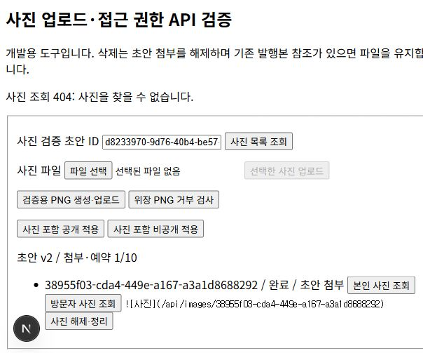
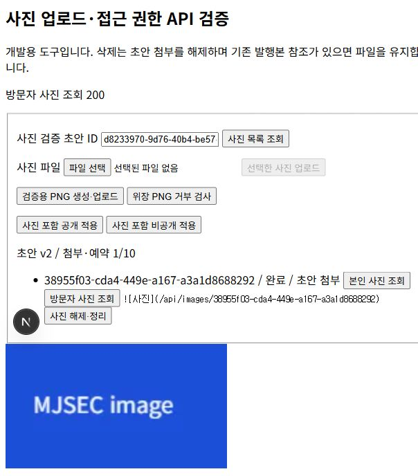
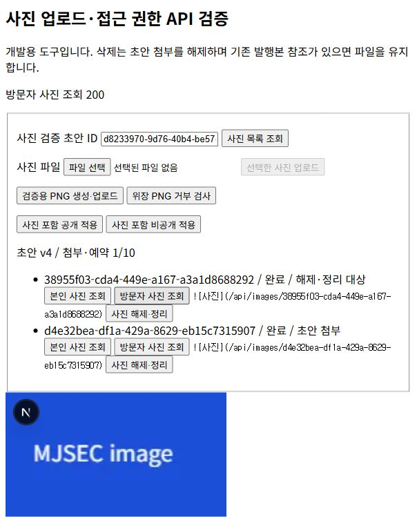
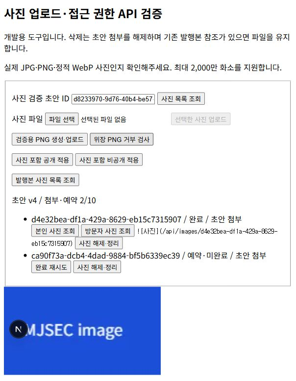
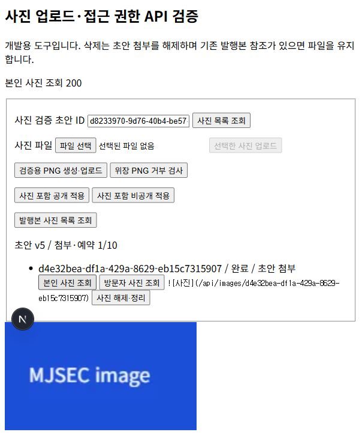

# 사진 업로드와 공개·비공개 접근 구현

프로젝트와 공부 기록에 실습 화면이나 결과 사진을 첨부할 수 있도록 사진 백엔드를 추가했다. JPG·PNG·WebP 원본을 최대 5MiB까지 받으며 한 글의 초안 첨부와 업로드 중 예약 합계는 10장으로 제한한다. 본문 삽입 버튼과 최종 작성 화면은 프런트엔드 단계에서 연결한다.

## 파일별 역할과 처리 흐름

| 파일 | 역할 |
|---|---|
| `lib/image.ts` | 입력 검증, 실제 이미지 디코딩·WebP 변환, 서버 전용 클라이언트, 참조 확인 후 파일 정리 |
| `app/api/drafts/[id]/images/route.ts` | 본인 사진 목록·초안 버전·10장 예약 |
| `app/api/images/[id]/complete/route.ts` | 소유권 확인→원본 다운로드→검증·변환→파일 저장→DB 완료 |
| `app/api/images/[id]/route.ts` | 권한에 따른 바이너리 조회·초안 첨부 해제·파일 정리 |
| `app/api/records/[id]/images/route.ts` | 마지막 발행본에 적용된 사진 목록 |
| `supabase/migrations/202610050007_images.sql` | private 버킷, 사진 테이블·발행 참조·RLS·잠금과 버전 검사 |
| `app/auth/check/image-check.tsx` | 실제 업로드·위장 PNG·공개 전환을 확인하는 개발용 도구 |
| `tests/images.test.ts` | 이미지 디코딩, API 요청 모의, PostgreSQL·Storage RLS 검사 |

브라우저가 파일의 MIME·크기와 현재 초안 버전으로 예약 API를 호출한다. DB는 초안 행을 잠가 소유자와 10장 제한을 확인하고 서버가 결정한 저장 경로를 반환한다. 브라우저는 로그인된 Supabase 클라이언트로 원본을 Storage에 직접 업로드한다. 완료 API가 실제 디코딩과 형식 일치를 검사한 뒤 WebP로 저장하고, DB 완료 함수가 사진 ready 상태와 초안 버전을 함께 바꾼다. 완료된 URL을 본문에 삽입하고 저장한 다음 발행 API를 호출해야 공개본에 적용된다.

5MiB 파일을 Next.js 함수 본문으로 보내면 Vercel의 4.5MB 한도를 넘을 수 있어 Storage 직접 업로드를 선택했다. API JSON에는 파일 바이트 대신 사진 정보만 들어간다. 실제 배포 환경 검증은 배포 단계에서 추가한다. [Vercel 함수 제한](https://vercel.com/docs/functions/limitations)

## 실제 파일 검사와 서버 키

파일 이름이나 선언 MIME만으로 사진이라고 판단하지 않는다. Sharp로 JPEG·PNG·WebP 형식과 MIME 일치를 확인하고 전체 픽셀을 디코딩하여 손상·지원하지 않는 형식을 거부한다. 최대 2,000만 화소, 감지된 다중 프레임 제한을 적용한다. 방향을 보정하고 최대 2560×2560 안으로 줄여 WebP로 재인코딩하며 EXIF 등 메타데이터를 제거한다. 저장된 사진은 원본 파일 보관 서비스가 아니라 웹 표시용 이미지다. [Sharp 생성자](https://sharp.pixelplumbing.com/api-constructor/)

일반 회원은 원본 경로만 쓸 수 있고 검증본 경로는 직접 쓸 수 없다. 완료 DB 함수도 회원이 직접 호출할 수 없다. 이를 위해 서버 전용 키를 로컬 `.env`의 SUPABASE_SECRET_KEY에 설정했다. 사용자 JWT로 소유권을 확인한 후에만 해당 사진을 처리하며 키를 응답·클라이언트 코드·Git에 포함하지 않는다. 일반 글·프로필 API는 기존 사용자 JWT와 RLS를 계속 사용한다.

## 초안과 공개본의 사진 분리

images는 초안에 붙은 사진과 예약 상태를 저장하고 record_images는 마지막으로 적용한 사진을 참조한다. 새 사진을 올려도 적용 전에는 본인만 접근한다. 공개 글 수정 중 기존 사진을 해제해도 발행 참조를 유지하므로 이전 화면이 즉시 깨지지 않는다. 다음 발행 요청에서 참조를 교체한다.

버킷은 private이며 사진 메타데이터와 Storage 객체 모두 RLS를 적용한다. 방문자는 공개·정상 발행본에 참조된 검증 사진만 읽는다. 공개 상태를 비공개로 바꾸거나 휴지통에 넣으면 새로운 방문자 요청을 막는다. 이미 내려받은 사진은 회수할 수 없다. API는 no-store로 응답하며 서명 URL은 발급하지 않는다. [Supabase Storage 접근 제어](https://supabase.com/docs/guides/storage/security/access-control)

본문 삽입 주소는 ``다. 비공개 사진의 본인 미리보기는 인증 헤더로 fetch한 Blob을 Object URL로 표시한다. JWT를 이미지 URL에 넣지 않는다.

## 오류와 해결

입력 검증 테스트에서 MIME 배열을 문자열로 변환하면 허용 MIME처럼 통과할 수 있는 문제가 발견됐다. String() 변환 대신 실제 문자열 타입과 허용 목록을 함께 검사하도록 수정했다.

완료 재시도가 저장된 파일을 덮어쓰면 공개본 사진도 바뀔 수 있어 검증본은 upsert=false로 저장한다. 이미 저장된 파일이 있으면 DB 완료를 재시도하며 파일은 교체하지 않는다. 중복 파일 응답에 대한 모의 API 검사도 추가했다.

파일 삭제와 DB 변경은 서로 다른 시스템이므로 실패를 숨기지 않는다. 첨부 해제 후 발행 참조가 없는 파일만 Storage API로 지우고 DB 메타데이터를 정리한다. 정리 실패는 cleanup_pending으로 반환해 재시도할 수 있게 했다. SQL로 storage.objects만 지우면 파일이 남을 수 있으므로 Storage API를 사용한다. [Supabase 파일 삭제](https://supabase.com/docs/guides/storage/management/delete-objects)

## 검증 자료

- 자동 검사: JPG·PNG·WebP 변환과 메타데이터 제거, 위장·손상·과대 화소·잘못된 크기·타입, 인증·서버 완료 권한, no-store, 정리 실패·재시도를 검사했다.
- PGlite: 실제 7개 마이그레이션을 적용하고 본인·타인·익명 역할로 DB·Storage RLS, 10장 제한, 기존 발행본 유지, 휴지통·비공개 복원과 정리를 확인했다. Storage 스키마는 권한 검사용 최소 형태이므로 실제 호스팅의 파일 업로드 동작과 구분한다.
- 실제 Supabase: 개발용 PNG를 생성해 직접 업로드하고 서버의 WebP 검증·저장 완료를 확인했다. 비공개 본인 조회 200, 방문자 404, 공개 적용 후 방문자 조회 200을 확인했다.
- 공개 후 새 초안 사진은 방문자 404였다. 기존 사진을 해제한 초안 v4에서도 이전 발행본 사진은 방문자 200으로 유지됐다. 비공개 적용 후 이전 사진의 Storage 객체와 DB 메타데이터가 정리되고 현재 사진은 방문자 404로 차단됐다.
- PNG MIME과 확장자를 붙인 일반 텍스트는 서버에서 거부됐으며 ready=false 예약으로 남았다. 해당 예약을 해제하여 파일·메타데이터 정리 완료를 확인했다.
- 사진 링크를 본문에 삽입해 초안 v5·비공개 발행 v3으로 저장했다. 새로고침 후 링크·완료 사진 1장이 유지됐고 본인 사진 조회가 200으로 성공했다. 발행본 사진 목록 API도 같은 1장을 반환했다. 이 검증용 기록은 최종적으로 비공개 상태다.
- 전체 테스트 33개, TypeScript 검사와 프로덕션 빌드가 통과했다. 마지막 입력 버전 범위 보완 후 사진 관련 검사와 빌드를 다시 통과했다.
- 브라우저 빌드 파일에서 실제 서버 키가 포함되지 않은 것을 검사했다. Git 추적에서 .env 제외를 확인했다.

현재 자동 만료·주기적 청소는 제공하지 않는다. 중단한 예약은 목록에서 취소하며 파일 정리가 실패하면 다시 요청한다. 원본·애니메이션 보존, 탈퇴에 따른 Storage 청소는 별도 확장 범위다. 이 자료는 게시 준비용이며 아직 티스토리에 올리지 않았다.
