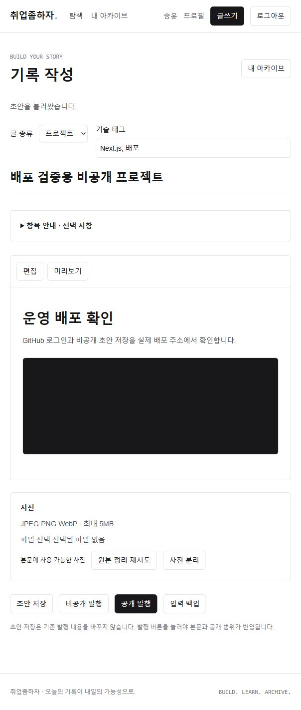
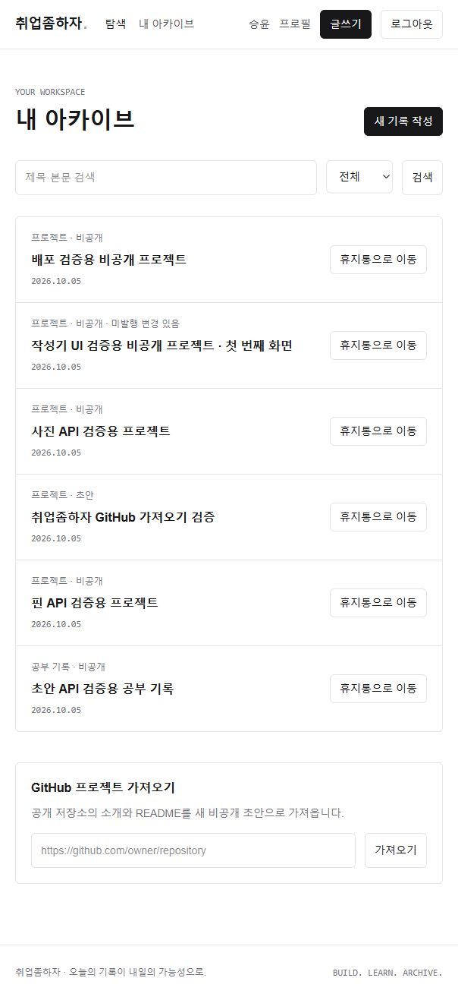

# Vercel 배포와 운영 연결 확인

구현한 취업좀하자를 Vercel에 배포했다. 운영 주소는 https://chwieop-jom-haja.vercel.app 이다. 기존 서울 Supabase의 인증·DB·Storage를 그대로 연결했다.

## 파일별 역할과 흐름

- `vercel.json`: 함수 리전 `icn1` 설정.
- `scripts/check-deployment.mjs`: 데이터 변경 없이 공개 화면·API 응답·인증 거부·환경 파일 비노출 확인.
- `docs/DEPLOYMENT.md`: 환경 변수 이름, 운영 주소, 로그인 반환 주소와 실제 검증 범위.
- 기존 인증 클라이언트: GitHub → Supabase 콜백 → 운영 사이트의 PKCE 코드 교환 → 프로필 복원. 코드 교환 후 URL의 code를 제거한다.
- 작성기: 사용자 토큰으로 초안 API 호출 → DB 저장 → 응답 상태 표시. 사진은 예약·Storage 직접 업로드·서버 변환/검증·본문 저장 순서다. 서버 전용 키는 브라우저에 전달하지 않는다.

## 설정과 해결 과정

Vercel Hobby 프로젝트를 개인 GitHub 저장소에 연결하고 `codex/planning`을 Production Branch로 사용했다. 운영 환경 변수 네 개를 Production 범위에 설정했다. 추가 DB 연동이나 유료 도메인은 구매하지 않았다.

처음에는 Supabase Site URL이 localhost였으므로 운영 주소로 변경하고, 운영 루트와 로컬 루트를 정확한 Redirect URL로 등록했다. 기존 개발 검증 경로도 유지했다. GitHub에서 Supabase로 돌아오는 OAuth callback은 변경하지 않았다.

Vercel 환경 변수 입력 화면이 다시 펼쳐져 서버 키가 도구 출력에 한 번 노출됐다. 이후 값이 있는 화면 조회는 숨김 처리했다. 키를 소스·Git·게시 자료에 포함하지 않았다. 비밀 값의 입력과 화면 캡처는 별도로 관리해야 한다.

## 실제 확인 결과

읽기 검사 15개를 운영 주소에서 통과했다. GitHub 로그인 후 기존 닉네임이 복원됐고, 검증용 프로젝트를 비공개 초안으로 저장했다. 생성한 테스트 PNG를 업로드해 서버 변환과 미리보기를 확인했다. 비공개 발행 후 새로고침해 제목·태그·본문·사진이 유지됐으며 내 아카이브에서 비공개 상태로 표시됐다. 비로그인 요청에서는 해당 글과 사진 모두 404였다.

검증 데이터는 비공개로 유지했다. 공개 기록이 없는 초기 피드는 정상적인 빈 결과다. 다른 계정 보관·토큰 만료·운영 공개 발행은 이번 단계에서 재검증하지 않았다. 이전 단계의 자동 테스트 42개와 타입 검사·빌드 결과를 배포 브라우저 검증과 구분한다.

개인 공개 포트폴리오와 핀/보관함·연결 관리 UI는 아직 남아 있다. 이 자료는 게시용 초안이며 티스토리에 올리지 않았다.
