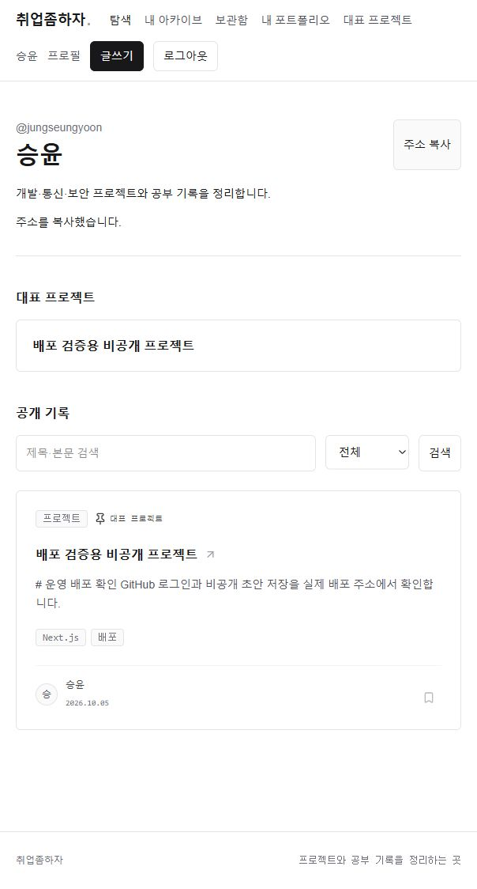
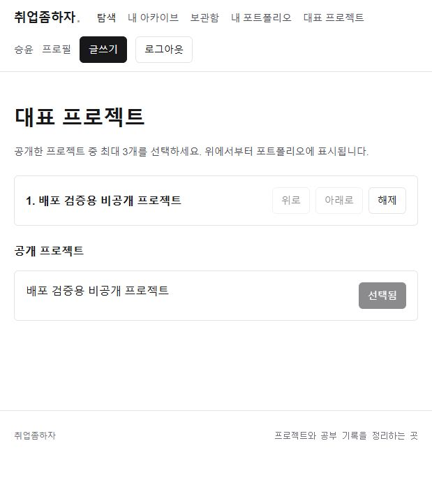
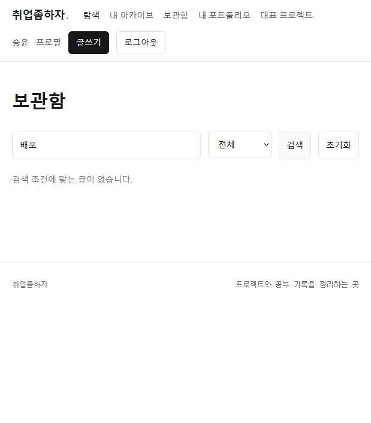
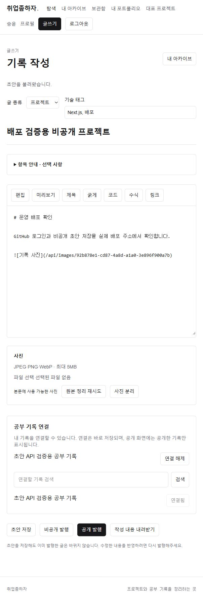

# 개인 포트폴리오와 관리 화면

개인 포트폴리오·대표 프로젝트·보관함·프로젝트–공부 기록 연결 관리 화면을 추가했다. 기존 인증과 API를 사용하며 별도 DB 테이블이나 마이그레이션은 추가하지 않았다.

## 파일과 데이터 흐름

- `Portfolio.tsx`, `app/u/[handle]/page.tsx`: 공개 프로필 → 작성자 UUID → 공개 핀과 공개 기록을 조회한다. 제목·본문 검색, 유형 선택, 더 보기, 주소 복사를 제공한다.
- `PinManager.tsx`: 본인 공개 프로젝트 목록과 저장된 핀을 조회한다. 최대 3개 선택·위/아래 이동·해제 시 전체 순서를 기존 API로 저장한다. 실패하면 기존 선택을 유지한다.
- `Bookmarks.tsx`: 본인 보관함을 서버에서 검색한다. 제목·유형과 페이지를 지정하며, 해제 성공 후 목록을 다시 조회한다. 실패 시 기존 글을 유지한다.
- `RecordLinks.tsx`: 저장한 초안의 연결과 연결할 후보를 조회한다. 프로젝트에는 공부 기록, 공부 기록에는 프로젝트를 연결한다. 연결·해제는 바로 저장되며 공개 상세에는 공개 연결만 표시한다.
- `portfolio-data.ts`: 목록 응답 검증과 핀 순서 변경을 처리한다. 인증·요청·카드·오류 안내는 기존 코드에서 재사용한다.
- `app/api/bookmarks/route.ts`: 제목 검색·유형·태그 조건을 추가했다. 본인 보관함, 타인의 공개 글, 미삭제 조건을 서버에서 적용하고 페이지를 나눈다. 전체 본문은 응답에서 제외한다.

## 검증

기존 자동 테스트 42개와 새 테스트 2개를 통과했다. 새 테스트는 잘못된 목록/페이지 거부, 핀 이동의 경계, 보관 검색의 사용자·공개/삭제 조건과 검색어 이스케이프·페이지 범위·본문 비노출을 확인한다. 기존 PostgreSQL 테스트는 두 사용자에 대한 보관 격리·본인 보관 금지·핀 한도/순서·관련 기록 공개 범위를 검증한다. 실제 두 GitHub 계정 브라우저 검증과 구분한다.

운영 사이트에서 검증용 프로젝트와 기존 공부 기록을 연결했다. 프로젝트만 잠시 공개해 대표 프로젝트 선택·새로고침 유지·개인 포트폴리오 표시와 공유 주소 복사를 확인했다. 공개 API에서는 비공개 공부 기록이 연결 목록과 연결 수에 포함되지 않았다. 보관함은 빈 결과와 제목 검색을 확인했다. 추가 GitHub 계정이 없어 실제 보관 추가·해제는 이번 브라우저에서 확인하지 않았다.

검증 결과를 전체 기능의 모든 오류 상황을 직접 재현했다는 의미로 사용하지 않는다. 티스토리에는 게시하지 않았다.

검증 후 연결을 해제하고 프로젝트를 비공개로 되돌렸다. 익명 상세 404와 공개 핀 자동 해제를 실제 API로 확인했다. 검증 화면 캡처는 잠시 공개한 시점의 모습이다.

